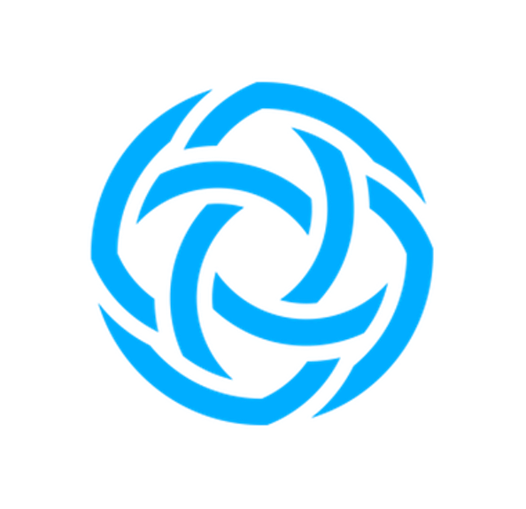

  

Welcome to the [Center for AI Safety's (CAIS)](https://safe.ai) Reading and Learning (RAL) event, held **bi-weekly**. This platform serves as a vibrant nexus where we dissect and explore recent publications from the Machine Learning community. Our discussions encompass an array of publications, not only emerging from CAIS but also those curated from outside our institution. We further enrich our events by inviting individuals external to CAIS to present their work, fostering a dynamic exchange of ideas and perspectives. To minimize the pressure when preparing the upcoming talk, we won't ask speakers to prepare slides beforehand (but you are more than welcome to do so). Just grab a cup of coffee or soda and relax!

Subscribe to all RAL events using this [link](https://calendar.google.com/calendar/u/0?cid=Y18yZmJjZmQ4Zjc1MjlmYzBjYjk3OWE3YjhlMGE3YmQzZTI0N2JiNTAwYmY5YmY3MzU0YzYzMzAyZDc4YWU3ODAwQGdyb3VwLmNhbGVuZGFyLmdvb2dsZS5jb20).

## RAL Outline
- Part I: Presentation and Short Questions (40 min)
- Part II: Long Questions and Discussion  (20 min)

## Upcoming Presentation

### [Do the Rewards Justify the Means? Measuring Trade-Offs Between Rewards and Ethical Behavior in the MACHIAVELLI Benchmark](https://arxiv.org/pdf/2304.03279.pdf)

**Date and Time**: 1 PM Pacific Time, September 14, 2023

**Location**: [Zoom](https://zoom.us/j/94246928900?pwd=akV1bWxDaEhzdkFRVXBSUHdKMUlHQT09)

**Speaker**: [Alexander Pan](https://aypan17.github.io/) (University of California, Berkeley)

**Abstract** 

  

    
Artificial agents have traditionally been trained to maximize reward, which may incentivize power-seeking and deception, analogous to how next-token prediction in language models (LMs) may incentivize toxicity. So do agents naturally learn to be Machiavellian? And how do we measure these behaviors in general-purpose models such as GPT-4? Towards answering these questions, we introduce MACHIAVELLI, a benchmark of 134 Choose-Your-Own-Adventure games containing over half a million rich, diverse scenarios that center on social decision-making. Scenario labeling is automated with LMs, which are more performant than human annotators. We mathematize dozens of harmful behaviors and use our annotations to evaluate agents' tendencies to be power-seeking, cause disutility, and commit ethical violations. We observe some tension between maximizing reward and behaving ethically. To improve this trade-off, we investigate LM-based methods to steer agents' towards less harmful behaviors. Our results show that agents can both act competently and morally, so concrete progress can currently be made in machine ethics--designing agents that are Pareto improvements in both safety and capabilities.

  

## Become a Speaker
We welcome people from universities and the industry to present their work at RAL! We are interested in topics varying from general AI safety to adversarial robustness, privacy, fairness, interpretability, language models, vision models, multimodality, etc. If you are interested in sharing your work with CAIS and other people, please fill out the following Google Form.

[Sign Up for RAL](https://forms.gle/UKbeV4obcsXZtLYa9)

## Past Presentations

### [Universal and Transferable Adversarial Attacks on Aligned Language Models](https://arxiv.org/abs/2307.15043) by [Andy Zou](https://andyzoujm.github.io/)

## Contact

If you have any questions, feel free to contact us at long_at_safe_dot_ai

