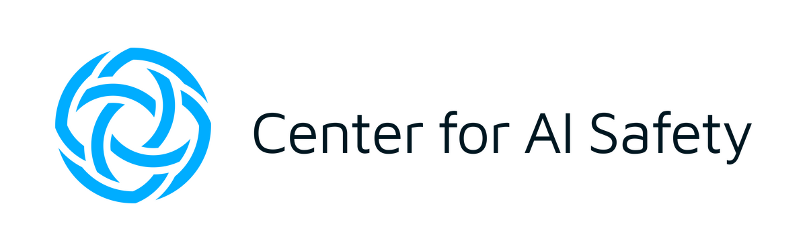

Welcome to the [Center for AI Safety's (CAIS)](https://safe.ai) Reading and Learning (RAL) event, held **bi-weekly**. This platform serves as a vibrant nexus where we dissect and explore recent publications from the Machine Learning community. Our discussions encompass an array of publications, not only emerging from CAIS but also those curated from outside our institution. We further enrich our events by inviting individuals external to CAIS to present their work, fostering a dynamic exchange of ideas and perspectives. To minimize the pressure when preparing the upcoming talk, we won't ask speakers to prepare slides beforehand (but you are more than welcome to do so). Just grab a cup of coffee or soda and relax!

Subscribe to all RAL events using this [link](https://calendar.google.com/calendar/event?action=TEMPLATE&tmeid=NnRpaTI1YjJqM3MyaGpraXJtNDdpcWI2NzNfMjAyMzA4MTBUMjAwMDAwWiB6aWZhbkBzYWZlLmFp&tmsrc=zifan%40safe.ai&scp=ALL).

## RAL Outline
- Part I: Presentation and Short Questions (40 min)
- Part II: Long Questions and Discussion  (20 min)

## Upcoming Presentation

### [Universal and Transferable Adversarial Attacks on Aligned Language Models](https://arxiv.org/abs/2307.15043)

**Date and Time**: 1 PM Pacific Time, August 17, 2023

**Location**: [Zoom](https://zoom.us/j/92425376598?pwd=TjNEYXBzZm1Td1ZhUFBHbmMraGRGQT09)

**Speaker**: [Andy Zou](https://andyzoujm.github.io/) (Carnegie Mellon University)

**Abstract** 

  

    
Because “out-of-the-box” <strong>large language models</strong> (LLMs) are capable of generating a great deal of objectionable content, recent work has focused on aligning these models in an attempt to prevent undesirable generation. While there has been some success at circumventing these measures – so-called “jailbreaks” against LLMs – these attacks have required significant human ingenuity and are brittle in practice.

    
In this paper, we propose a simple and effective attack method that causes aligned language models to generate objectionable behaviors. Specifically, our approach finds a suffix that, when attached to a wide range of queries for an LLM to produce objectionable content, aims to maximize the probability that the model produces an affirmative response (rather than refusing to answer). However, instead of relying on manual engineering, our approach automatically produces these adversarial suffixes by a combination of greedy and gradient-based search techniques, and also improves over past automatic prompt generation methods. Surprisingly, we find that the adversarial prompts generated by our approach are quite transferable, including to black-box, publicly released LLMs.

    
Specifically, we train an adversarial attack suffix on multiple prompts (i.e., queries asking for many different types of objectionable content), as well as multiple models (in our case, <em>Vicuna-7B</em> and <em>13B</em>). When doing so, the resulting attack suffix is able to induce objectionable content in the public interfaces to ChatGPT, Bard, and Claude, as well as open source LLMs such as LLaMA-2-Chat, Pythia, Falcon, and others. In total, this work significantly advances the state-of-the-art in adversarial attacks against aligned language models, raising important questions about how such systems can be prevented from producing objectionable information.

  

## Become a Speaker
We welcome people from universities and the industry to present their work at RAL! We are interested in topics varying from general AI safety to adversarial robustness, privacy, fairness, interpretability, language models, vision models, multimodality, etc. If you are interested in sharing your work with CAIS and other people, please fill out the following Google Form.

[Sign Up for RAL](https://forms.gle/UKbeV4obcsXZtLYa9)

## Past Presentations

## Contact

If you have any questions, feel free to contact us at long_at_safe_dot_ai

